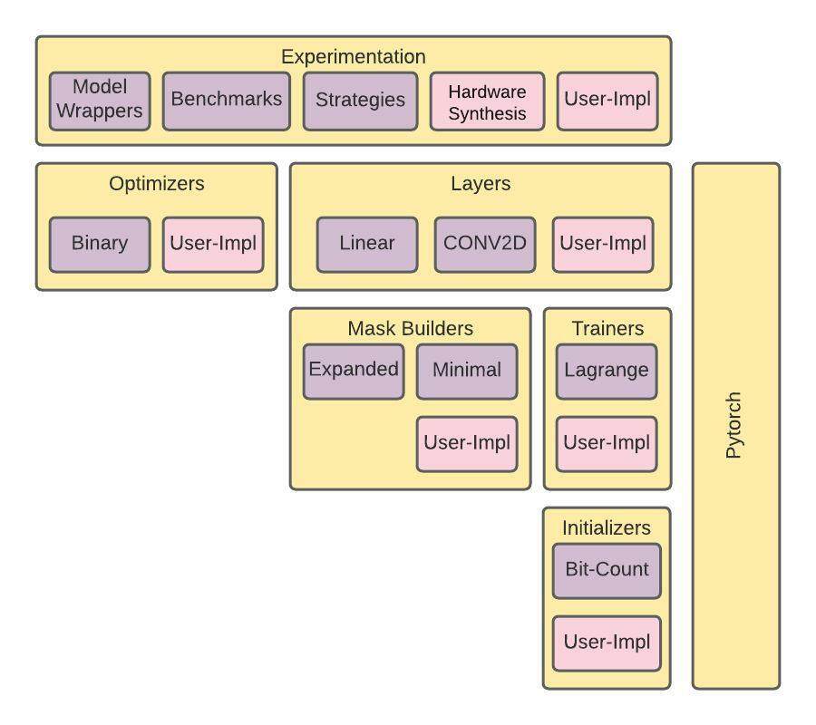

# DeepLut : Deep Neural Network Framework using Lookup Tables
Welcome to DeepLUT

Contents:
<!-- TOC depthFrom:2 depthTo:6 withLinks:1 updateOnSave:1 orderedList:0 -->
* [General](#General)
* [What is DeepLut?](#what-is-deeplut)
* [Why DeepLut is needed?](#why-deeplut-is-needed)
<!-- /TOC -->

## General

* [Documentation](https://deeplut.github.io/).

## What is DeepLut?

A Python library that aims to provide a flexible, extendible, lightening fast, and easy-to-use framework to train look-up tables (LUT) deep neural networks from scratch.

## Why DeepLut is needed?
We believe having a flexible, extendible, fast, and easy framework will help in advancing the research in this area. Frameworks enable innovation and make researchers focus on experimentation. Extendible will help in building an ecosystem between researchers to add plugins and implement innovative modules to benefit all other researchers.